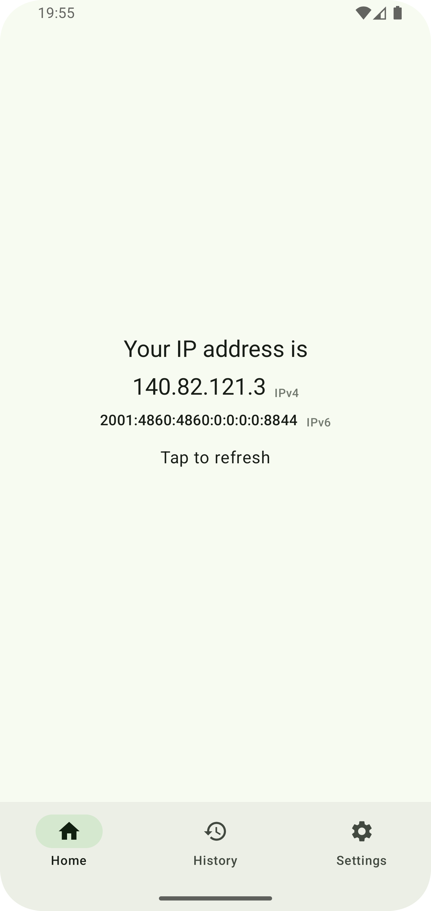
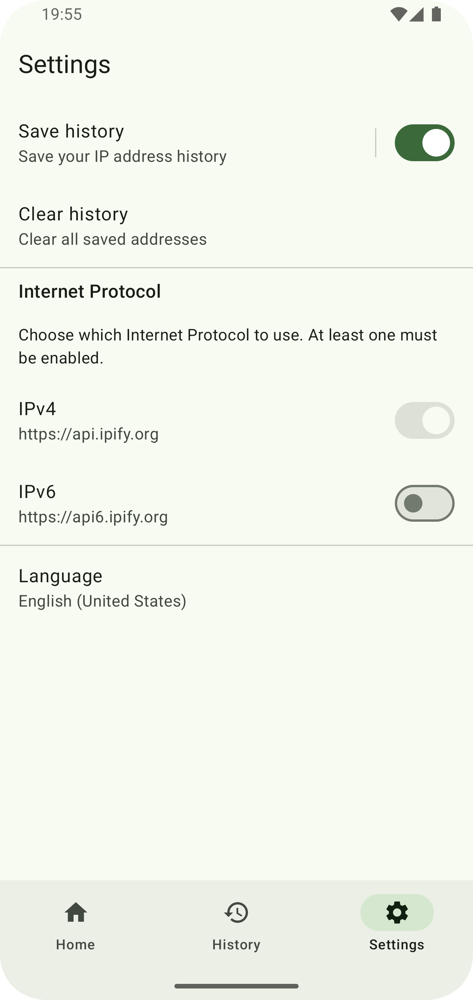
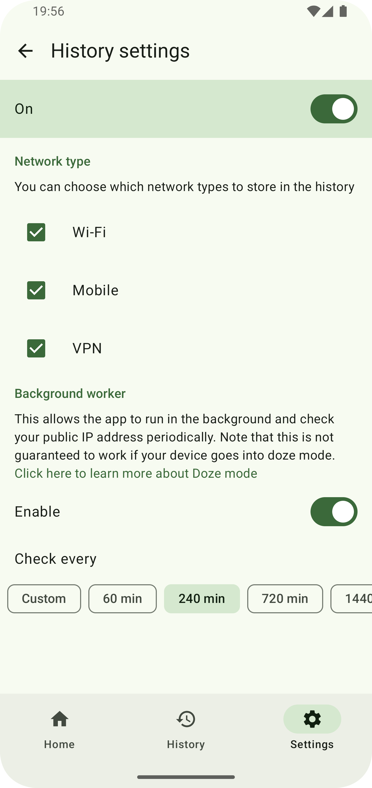

## Find my IP

[](https://f-droid.org/repository/browse/?fdid=com.maksimowiczm.findmyip)

### What is this?

Find My IP is a straightforward Android app designed to fetch and optionally store your current IP
address, helping you keep a history of your IP addresses. It can automatically log IP changes in the
background, so you don't have to open the app every time.

<br>

<div align="center">
    
    
    
    
    
    
</div>

<br>

### How does it work?

The application uses the [`api.ipify.org`](https://api.ipify.org) API to get the IP address of the
device.

### Why does it exist?

I needed a simple way to get my IP address history on my phone, so I made this app.

### Smiliar apps

- [Public IP](https://github.com/guildem/publicip-android) - does not allow to store IP history

## License

```
Copyright (C) 2024 Mateusz Maksimowicz

This program is free software: you can redistribute it and/or modify it under the terms of the GNU General Public License as published by the Free Software Foundation, either version 3 of the License, or (at your option) any later version.

This program is distributed in the hope that it will be useful, but WITHOUT ANY WARRANTY; without even the implied warranty of MERCHANTABILITY or FITNESS FOR A PARTICULAR PURPOSE. See the GNU General Public License for more details.

You should have received a copy of the GNU General Public License along with this program. If not, see <https://www.gnu.org/licenses/>.
```

### Launcher icon

Icon made by Freepik from [www.flaticon.com](https://www.flaticon.com/)

