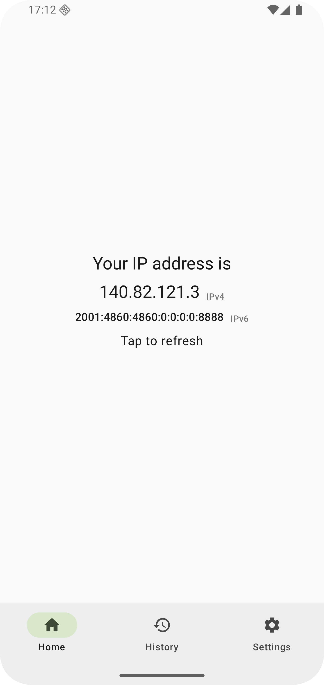
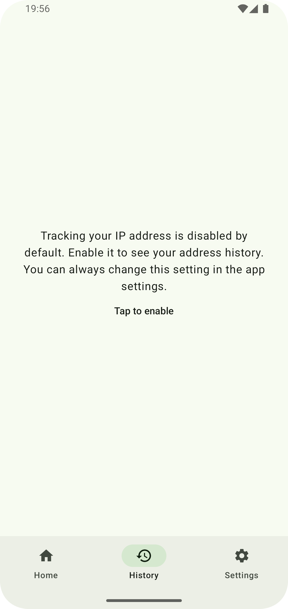
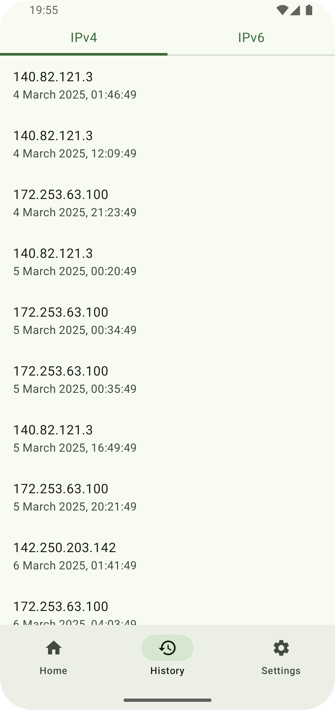
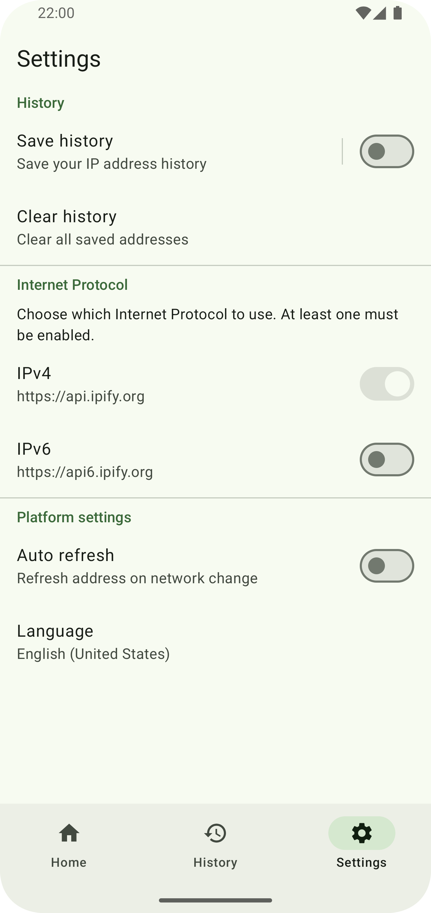
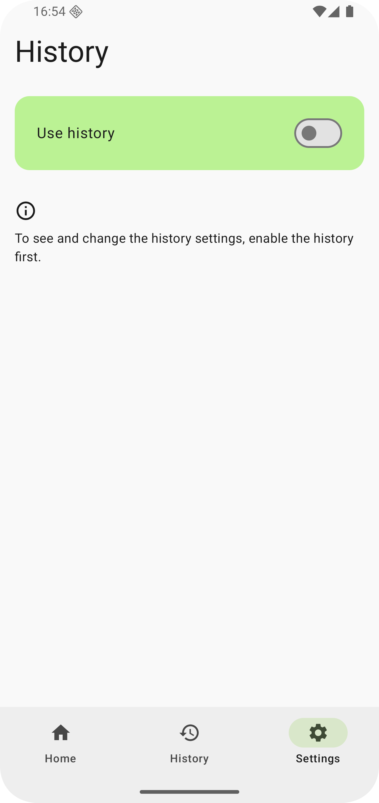
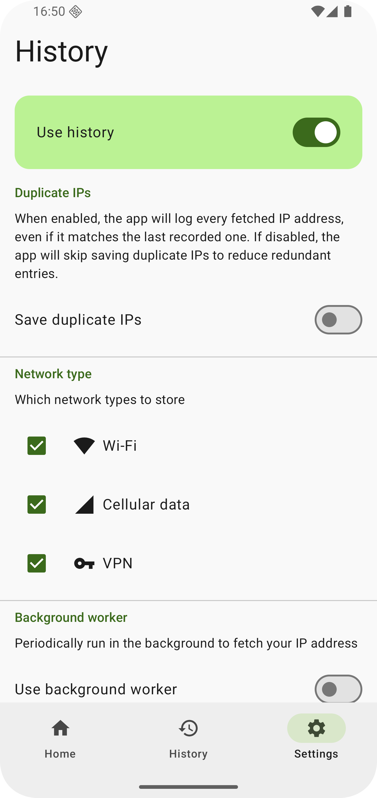
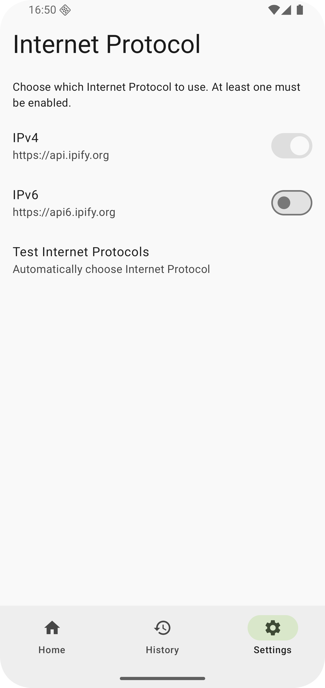
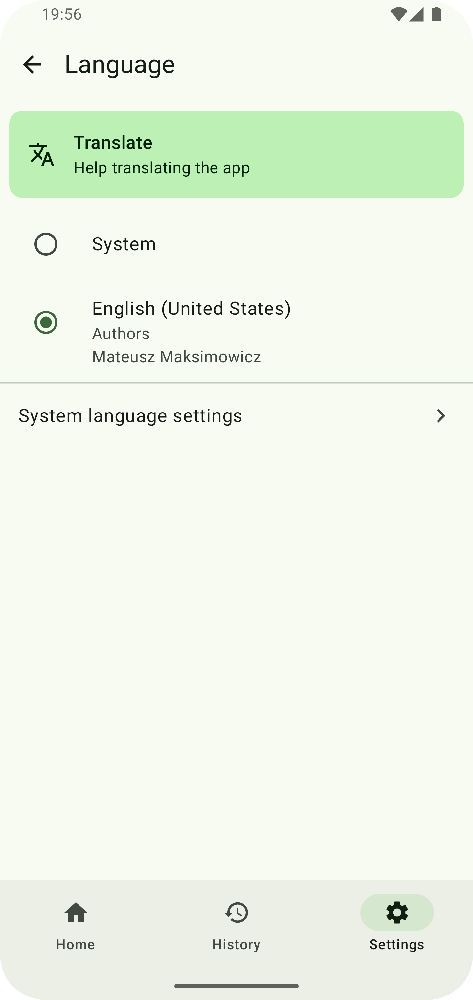

## Find My IP

[](https://f-droid.org/repository/browse/?fdid=com.maksimowiczm.findmyip)

### 📌 What is Find My IP?

**Find My IP** is a simple Android app that fetches and stores your current IP address. It helps you
maintain a history of your IP addresses and can log IP changes automatically in the background—no
need to open the app every time.

---

### 📷 Screenshots

<div align="center">
    
    
    
    
        
    
    
    
</div>

---

### ❓ Why was it created?

I needed a straightforward way to track my IP address history on my phone, so I built this app. Now
I use it as a playground for my Android development projects.

---

### 🔄 Similar Apps

- [Public IP](https://github.com/guildem/publicip-android) - Does not support IP history storage.

---

### 🌍 Contribute to Translations

Help translate **Find My IP** on [Crowdin](https://crowdin.com/project/find-my-ip)!

---

### 📜 License

```
Copyright (C) 2024-2025 Mateusz Maksimowicz

This program is free software: you can redistribute it and/or modify it under the terms of the GNU General Public License as published by the Free Software Foundation, either version 3 of the License, or (at your option) any later version.

This program is distributed in the hope that it will be useful, but WITHOUT ANY WARRANTY; without even the implied warranty of MERCHANTABILITY or FITNESS FOR A PARTICULAR PURPOSE. See the GNU General Public License for more details.

You should have received a copy of the GNU General Public License along with this program. If not, see <https://www.gnu.org/licenses/>.
```
