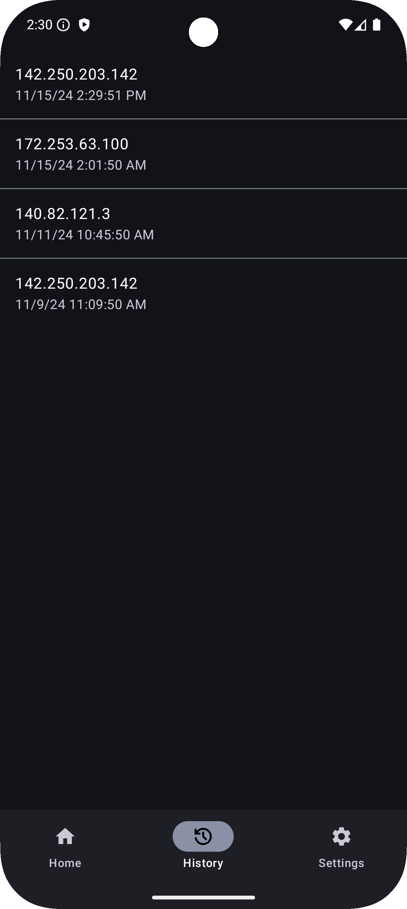
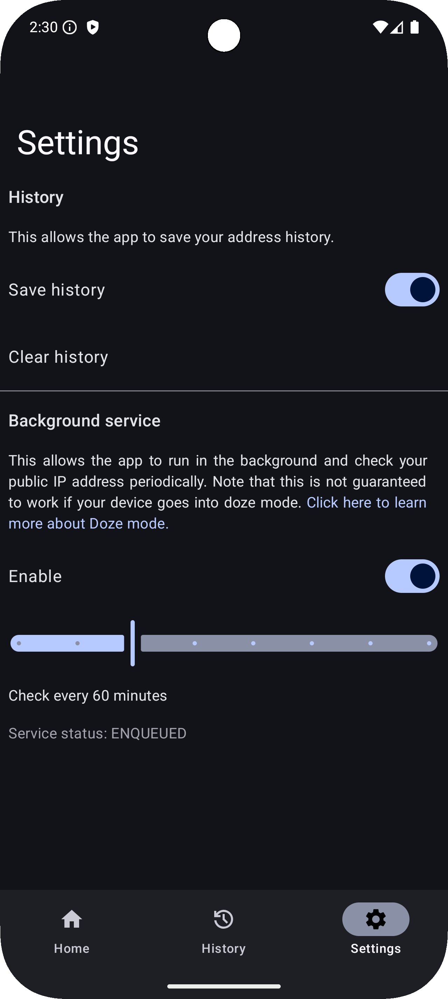

## Find my IP

### What is this?

Find My IP is a straightforward Android app designed to fetch and optionally
store your current IP address, helping you keep a history of your IP addresses.
It can automatically log IP changes in the background, so you don't have to open
the app every time.

   

### How does it work?

The application uses the [`api.ipify.org`](https://api.ipify.org) API to get the
IP address of the device.

### Why does it exist?

I needed a simple way to get my IP address history on my phone, so I made this
app.

### Smiliar apps

- [Public IP](https://github.com/guildem/publicip-android) - does not allow to
store IP history

### Launcher icon

Icon made by Freepik from [www.flaticon.com](https://www.flaticon.com/)

