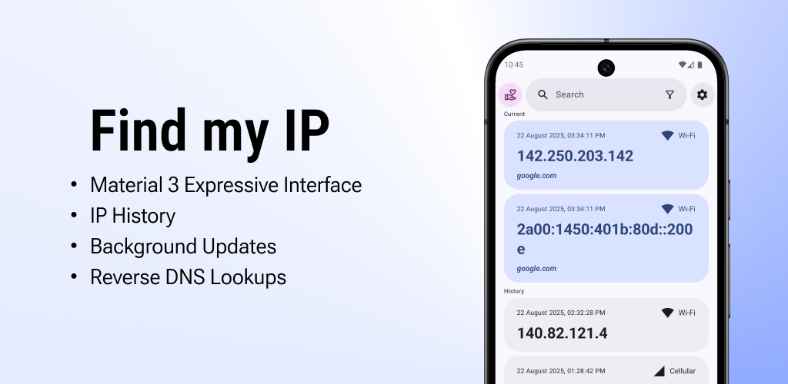
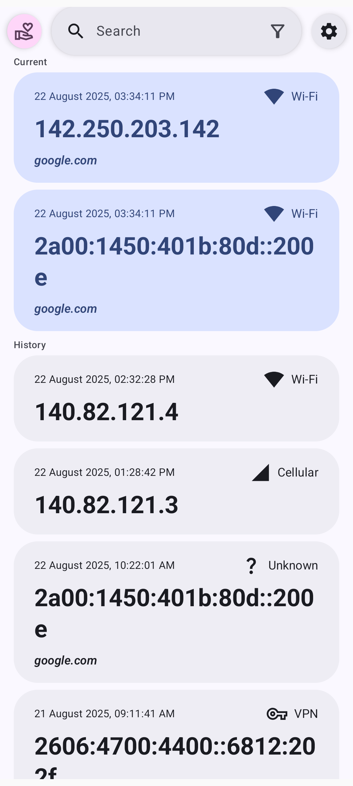

[](f-droid.org/repository/browse/?fdid=com.maksimowiczm.findmyip)
[](https://github.com/maksimowiczm/find-my-ip/releases/latest/)
[](https://github.com/maksimowiczm/find-my-ip/releases/)
[](https://github.com/maksimowiczm/find-my-ip/stargazers)

<div align="center">
    
</div>
<div align="center">

[](https://f-droid.org/packages/com.maksimowiczm.findmyip)
[](https://github.com/maksimowiczm/find-my-ip/releases)

</div>

---

**Find my IP** is a lightweight app that fetches and stores your current IP address. It keeps a
history of your past IPs and can automatically log changes in the background — no need to open the
app every time.

---

<div align="center">
    
    
</div>

---

### ✨ Features

- 🎨 **[Material 3 Expressive](https://m3.material.io/blog/building-with-m3-expressive) Design** -
  modern, clean, and user-friendly interface
- 🌐 **IPv4 & IPv6 Support** - works seamlessly with both IP address types
- 📜 **IP History** - maintains a log of your previous IP addresses
- 🔔 **Background Updates** - optionally detects and records IP changes even when the app is closed
- 🧭 **Reverse DNS Lookups** - resolve IP addresses back to domain names

---

### 🔄 Similar Apps

- [Public IP](https://github.com/guildem/publicip-android) - Does not support IP history storage.

---

### 🎨 Design

Explore the design mockups and prototypes
on [Figma](https://www.figma.com/design/BDNLirxKWIx8BljIWhEz6B/Find-my-IP-4?node-id=108-1005&t=rrTgk4k8pJWFqO4L-1)

---

### 🌍 Contribute to Translations

Help translate **Find My IP** on [Crowdin](https://crowdin.com/project/find-my-ip)!

---

### 📜 License

```
Copyright (C) 2024-2025 Mateusz Maksimowicz

This program is free software: you can redistribute it and/or modify it under the terms of the GNU General Public License as published by the Free Software Foundation, either version 3 of the License, or (at your option) any later version.

This program is distributed in the hope that it will be useful, but WITHOUT ANY WARRANTY; without even the implied warranty of MERCHANTABILITY or FITNESS FOR A PARTICULAR PURPOSE. See the GNU General Public License for more details.

You should have received a copy of the GNU General Public License along with this program. If not, see <https://www.gnu.org/licenses/>.
```
